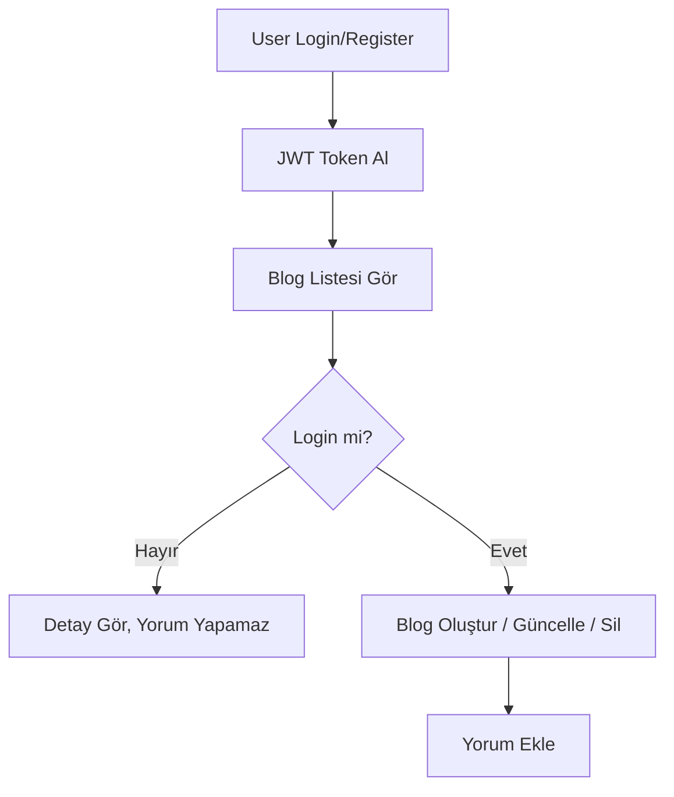

# DogusProject

DogusProject, ASP.NET Core MVC ile geliştirilmiş Clean Architecture yapısını benimseyen, kullanıcıların blog yazıları oluşturup yönetebildiği, yetkilendirme ve kimlik doğrulama sistemlerini içeren tam donanımlı bir web uygulamasıdır. 

## İçindekiler
- [Proje Mimarisi](#proje-mimarisi)
- [Katmanlar](#katmanlar)
- [Flow Chart](#flow-chart)
- [Kurulum](#kurulum)
- [Kullanılan Teknolojiler](#kullanılan-teknolojiler)
- [API Endpointleri](#api-endpointleri)
- [Proje Özellikleri](#proje-özellikleri)

---

## Proje Mimarisi
Proje Clean Architecture prensiplerine uygun şekilde organize edilmiştir:
- **SOLID** prensiplerine uygun
- **CQRS** pattern kullanılmıştır
- **Repository Pattern** ile veritabanı erişimi
- **Dependency Injection** ile servis tüm katmanlarda ayrıstırılmıştır

## Katmanlar

### 1. API Katmanı (`DogusProject.API`)
- HTTP isteklerini kabul eder
- Controller yapısı bulunur
- Middleware, filtre ve endpoint tanımları burada yapılır

### 2. Web Katmanı (`DogusProject.Web`)
- Razor View, Partial View, Layout dosyaları
- MVC yapısı
- Kullanıcı arayüzü

### 3. Application Katmanı (`DogusProject.Application`)
- DTO'lar, Command/Query nesneleri
- Validation, Mapping, Business Logic

### 4. Domain Katmanı (`DogusProject.Domain`)
- Entity, ValueObject, Enum, Interface ve Domain kural tanımları

### 5. Infrastructure Katmanı (`DogusProject.Infrastructure`)
- Dosya ekleme, Identity işlemleri

### 6. Persistence Katmanı (`DogusProject.Persistence`)
- EF Core DbContext
- Repository implementasyonları
- Migrations, Seed data

---

## Flow Chart



---

## Kurulum
1. Projeyi clone edin:
```bash
git clone https://github.com/kullaniciadi/DogusProject.git
```
2. Gerekli NuGet paketlerini yüklen:
```bash
dotnet restore
```
3. Veritabanını oluşturun:
```bash
dotnet ef database update --project DogusProject.Persistence
```
4. API ve Web katmanını başlatın:
```bash
dotnet run --project DogusProject.API
dotnet run --project DogusProject.Web
```

---

## Kullanılan Teknolojiler
- ASP.NET Core 8.0 MVC
- Entity Framework Core
- PostgreSQL
- MediatR
- AutoMapper
- FluentValidation
- JWT Authentication
- Bootstrap 5

---

## Örnek API Endpointleri
```bash
# Kullanıcı Giriş
curl -X POST https://localhost:5001/api/Auth/login -H "Content-Type: application/json" -d '{"email": "admin@example.com", "password": "string"}'

# Blog Oluştur
curl -X POST https://localhost:5001/api/Blog -H "Authorization: Bearer <token>" -H "Content-Type: application/json" -d '{"title":"Yeni Blog", "content": "içerik..."}'

# Blog Listesi
curl https://localhost:5001/api/Blog

# Kategori Listesi
curl https://localhost:5001/api/Category
```

---

## Proje Özellikleri
1. Kullanıcılar kayıt olabilir, giriş yapabilir, token alabilir.
2. JWT tabanlı kimlik doğrulama.
3. Blog CRUD işlemleri (Create, Read, Update, Delete).
4. Bloglar kategorilere bağlı.
5. Yorum sistemi (Yalnızca giriş yapmış kullanıcılar tarafından).
6. Bloglara bir veya birden fazla görsel yükleme (opsiyonel).
7. Validasyonlar ve hata mesajları FluentValidation ile yönetilir.

---

## Katkı
Projeye katkı sağlamak isterseniz Pull Request oluşturabilir ya da issue açabilirsiniz.

---

© 2025 DogusProject
